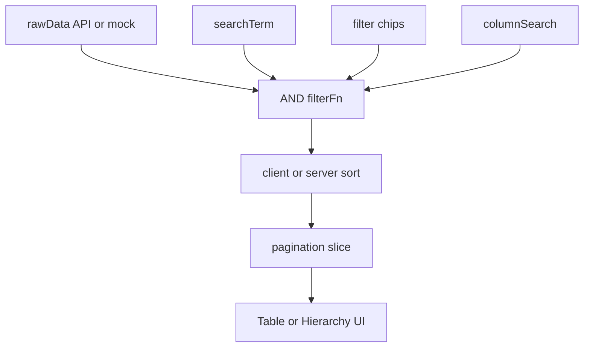
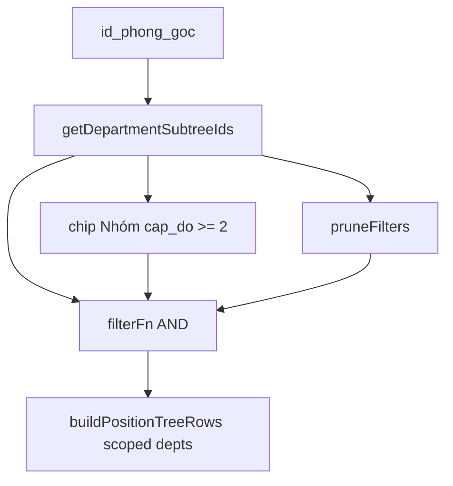

# Báo cáo sâu — Chức năng trang chính module Hệ thống

**Ngày:** 2026-07-16  
**Phạm vi:** Trang chính (list / matrix / singleton / dashboard) của các module dưới `/he-thong`  
**Nguồn:** code runtime (`features/he-thong/*`, `components/shared/*`, `lib/factories/*`, `server/`)  
**Đối chiếu nền:** [`page-pattern.md`](./page-pattern.md) · [`business-foundation.md`](./business-foundation.md) · [`business-foundation-audit.md`](./business-foundation-audit.md) · [`UI-CONVENTIONS.md`](./UI-CONVENTIONS.md)

Tài liệu này mô tả **hành vi thực tế** (user-facing + pipeline kỹ thuật) để soi thừa / thiếu / lệch — không phải spec mong muốn.

---

## 0. Tóm tắt điều hành

Ba module CRUD (Nhân viên · Phòng ban · Chức vụ) dùng chung foundation (`GenericToolbar`, filter chip, factories, drawer form/detail, Import/Export). Phân quyền và Thông tin công ty đúng kiểu UI khác (matrix / singleton).

| Điểm nóng | Hiện trạng |
|-----------|------------|
| Filter phụ thuộc (cascade options) | Chỉ **Chức vụ** (Nhóm ⊂ Phòng gốc + prune) |
| Resize cột | Chỉ **Nhân viên** (`GenericTable`) |
| Hybrid chip + column-header | Cả 3 CRUD (grandfathered; module mới không copy) |
| Server pagination NV | **D2.1:** luôn server filter + page + COUNT thật + stats aggregates |
| Persist cột / filter | Không (Zustand session; `resetState` khi unmount) |
| Tab thống kê | Chỉ Nhân viên |

---

## 1. Bản đồ module & Page Pattern

| Module | Pattern | Shell | Route trang chính |
|--------|---------|-------|-------------------|
| Nhân viên | **A** CRUD List + Stats | `createFeatureModule` | `/he-thong/nhan-vien` |
| Phòng ban | **B** Hierarchy | `createHierarchyFeatureModule` | `/he-thong/phong-ban` |
| Chức vụ | **B** UI trên data phẳng | `createFlatListFeatureModule` + tree rows | `/he-thong/chuc-vu` |
| Phân quyền | **D** Matrix | Custom | `/he-thong/phan-quyen` |
| Thông tin công ty | **C** Singleton | Custom form page | `/he-thong/thong-tin-cong-ty` |
| Dashboard Hệ thống | **E** | `ModuleDashboardLayout` | `/he-thong` |

Chi tiết chọn pattern: [`page-pattern.md`](./page-pattern.md).

---

## 2. Nền tảng dùng chung (Shared)

### 2.1 Building blocks

| Concern | Implementation | Ghi chú hành vi |
|---------|----------------|-----------------|
| Toolbar | [`GenericToolbar`](../components/shared/GenericToolbar.tsx) | Search, chips, clear, ColumnManager, bulk bar, MobileFilterSheet / MobileActionsSheet, phím `/` focus search |
| Chip multi | [`FilterChipMultiSelect`](../components/shared/FilterChipMultiSelect.tsx) | Multi-select; “Chọn tất cả / Xóa chọn” |
| Ẩn option count = 0 | [`filterOptionsWithCount`](../lib/filterOptionsWithCount.ts) | Giữ option đang chọn dù count = 0; `count === undefined` luôn hiện |
| Chip single | `FilterChipSingleSelect` | Có trong catalog; **chưa module nào dùng** |
| Filter counts | [`createFilterCountsHook`](../lib/factories/createFilterCountsHook.ts) | Exclude-self (xem §2.2) |
| Flat table | [`GenericTable`](../components/shared/GenericTable.tsx) | Resize, virtual (>50 dòng/trang), sticky header + sticky left N + sticky actions, density prop, page sizes 10/20/30/50/100 |
| Hierarchy table | [`HierarchyTable`](../components/shared/HierarchyTable.tsx) + [`HierarchyListShell`](../components/shared/HierarchyListShell.tsx) | Flatten tree; sticky checkbox + actions; **không** resize / virtual / sticky cột data; pagination `TablePaginationFooter` |
| Column manager | [`ColumnManager`](../components/shared/ColumnManager.tsx) | Ẩn/hiện + kéo thứ tự; session only |
| Column header | `components/shared/column-header/*` | MultiSelect filter **hoặc** SortMenu + text search |
| Store UI | [`createGenericStore`](../store/createGenericStore.ts) | `pageSize` mặc định 20; **không** `persist`; factory gọi `resetState` khi unmount |
| Scroll | `useScrollRestoration` qua Layout | Back restore / push top — **không** sync filter lên URL |

### 2.2 Quy tắc filter chung

**List (filterFn):**

| Quan hệ | Quy tắc |
|---------|---------|
| Giữa search, từng chip, columnSearch | **AND** |
| Trong một chip multi-select | Giá trị ∈ danh sách đã chọn (**OR** giữa các value); mảng rỗng = “tất cả” |
| Column search | Mỗi cột đang gõ: **AND**, `includes` không phân biệt hoa thường |

**Count trên option chip (exclude-self):**

1. Base: bản ghi qua `matchesSearch` ∧ `matchesColumnSearch`
2. Với mỗi dimension: đếm sau khi áp **các filter khác** (không áp filter của chính dimension đang đếm)
3. Không thay đổi logic lọc list — chỉ đổi số badge

**Search toolbar:** ghi thẳng `setSearchTerm` — **không debounce**.

### 2.3 Pipeline list (CRUD)



---

## 3. Nhân viên (Page Pattern A + Stats)

**Entry:** [`features/he-thong/nhan-vien/nhan-vien.module.tsx`](../features/he-thong/nhan-vien/nhan-vien.module.tsx)  
**Toolbar / Table / Stats / Bulk:** `components/nhan-vien-toolbar.tsx`, `nhan-vien-table.tsx`, `nhan-vien-stats.tsx`, `nhan-vien-bulk-edit.tsx`  
**List hook:** [`hooks/use-employees-list.ts`](../features/he-thong/nhan-vien/hooks/use-employees-list.ts)  
**Store:** `store/useEmployeeStore.ts`  
**Resource quyền:** `employees`

### 3.1 Toolbar

| Feature | Chi tiết |
|---------|----------|
| Search | Instant; `matchesSearchTerm` trên `NHAN_VIEN_SEARCHABLE_KEYS`: `id`, `ho_ten`, `ten_dang_nhap`, `ten_chuc_vu`, `email`, `so_dien_thoai`, `tg_tao`, `gioi_tinh`, `trang_thai`, `ten_phong_ban`, `ten_bo_phan`, `trang_thai_text`, `tg_tao_text` |
| Chips (multi) | Phòng ban · Chức vụ · Trạng thái · Giới tính |
| Overflow chip | `ToolbarFilterChipGroup` `maxVisible={3}` → chip thứ 4 (thường **Giới tính**) vào nút “+” |
| Options | `useDepartments()` / `usePositions()` (full) + counts `useFilterCounts` |
| Filter dependency | **Không.** Chọn phòng không thu hẹp options chức vụ — chỉ AND trên dòng + exclude-self counts |
| Clear all | Clear search + `columnSearch` + 4 chip arrays — **không** clear sort |
| Add / Import / Export | `useResourcePermissions`: `canCreate` / `canImport` / `canExport` |
| Bulk (khi có selection) | Quick status → `Đang làm việc` / `Nghỉ việc` (`canEdit`); mở bulk-edit drawer (`canEdit`); xóa nhiều (`canDelete`) |
| Column manager | Toggle + reorder + reset; không localStorage |
| Mobile | `filterGroups` → MobileFilterSheet; `mobileActions` → import/export (+ bulk edit nếu có selection) |

### 3.2 Hybrid chip ↔ header

| Dimension | Toolbar chip | Column header |
|-----------|--------------|---------------|
| Phòng ban | MultiSelect | `ten_phong_ban` → `ColumnHeaderFilter` (cùng store) |
| Chức vụ | MultiSelect | `ten_chuc_vu` → `ColumnHeaderFilter` |
| Trạng thái | MultiSelect | `trang_thai` → `ColumnHeaderFilter` |
| Giới tính | MultiSelect (hay overflow) | **Không** MultiSelect header — chỉ `ColumnHeaderSortMenu` + `ColumnHeaderSearch` (`columnSearch`) |
| Cột khác | — | SortMenu + columnSearch |

Cột đã có MultiSelect header **không** dùng columnSearch text (`COLUMN_IDS_WITH_MULTISELECT_SEARCH`).

### 3.3 Filter pipeline & store (D2.1)

```
store (search + chips + columnSearch + sort + page)
  → GET /nhan-vien (+ filter-counts)
  → table nhận 1 trang đã lọc/sort (serverPaginated)
```

Store: `searchTerm`, `filters.{columnSearch, trang_thai[], phong_ban_id[], gender[], position[]}`, `sort`, `pagination`, `selectedIds`, `columns`.

### 3.4 Search thống nhất

List mock / facet mock dùng chung `NHAN_VIEN_SEARCHABLE_KEYS` + `matchesSearchTerm`. API search cover các field DB + join tên phòng/chức vụ (không có `ten_bo_phan` cột riêng).

### 3.5 Server-side list (D2.1)

List Nhân viên **luôn** phân trang + lọc trên server (không còn dual-mode threshold 500 / sample stats).

| Concern | Contract |
|---------|----------|
| List | `GET /nhan-vien?limit&offset&orderBy&ascending&search&trang_thai&phong_ban_id&chuc_vu_id&gioi_tinh&columnSearch` → `{ items, total }` |
| Count | `GET /nhan-vien/count` — `COUNT(*)` thật với cùng filter |
| Facets | `GET /nhan-vien/filter-counts` — exclude-self |
| Stats | `GET /nhan-vien/stats/aggregates` — KPI/charts trên toàn bộ dữ liệu khớp filter |
| Take | Clamp `1..100` (khớp page size UI) |

Client: store giữ state → `useEmployeesList` gửi query; `filterFn` list = pass-through. Search keys dùng chung [`core/search-keys.ts`](../features/he-thong/nhan-vien/core/search-keys.ts) (`NHAN_VIEN_SEARCHABLE_KEYS` + `matchesSearchTerm`) cho mock / docs. Gap chấp nhận: `ten_bo_phan` derived không có cột DB riêng trên server search.

### 3.6 Edge cases còn lại

1. **Quick bulk status** chỉ 2 giá trị; bulk-edit / dialog dòng đủ 4 trạng thái.
2. Cột / resize / filter **mất** khi rời trang (`resetState`).
3. Bulk edit / export “toàn bộ kết quả lọc” vẫn dựa selection/page hiện có trong factory (sticky ids qua trang; items chỉ hydrate từ page đã load).
4. PB/CV vẫn full-client list (follow-up D2.1b).

### 3.7 Table (`GenericTable`)

| Feature | Hành vi |
|---------|---------|
| Resize cột | Có (`resizeColumn` trong store) |
| Reorder trong header | Không (chỉ ColumnManager) |
| Sort | Một cột; client nếu không server-paginated; server order khi server mode |
| Selection | Checkbox; select-all = **ids trang hiện tại** |
| Virtual scroll | Tự bật nếu > 50 dòng trên trang |
| Sticky | Header; `stickyLeftCount={2}`; cột actions phải |
| Density | Prop hỗ trợ compact/default/comfortable — EmployeeTable **không truyền** → luôn `default`; không UI đổi density |
| Row click | → detail drawer |
| Row actions | Edit / delete / status qua `useCanOnRecord` |
| Mobile | `MobileListCard` (avatar, badge, chức vụ, actions) |
| Cột mặc định hiện | họ tên, login, SĐT, chức vụ, phòng, bộ phận, email, giới tính, trạng thái; ẩn: `tg_tao`, `tg_cap_nhat` |

### 3.8 Bulk edit drawer

| Field UI | Payload |
|---------|---------|
| Bật Chức vụ | `chuc_vu_id` + auto `phong_ban_id` từ position |
| Bật Trạng thái | 4 giá trị STATUS_OPTIONS |
| Phòng ban độc lập | Không (chỉ derive từ chức vụ) |

Footer bulk-edit hiện **không** dùng `FormDrawerFooter` chuẩn (grandfathered).

### 3.9 Tab thống kê

| Concern | Chi tiết |
|---------|----------|
| URL | `?tab=list\|stats` |
| Data | Sample tối đa 500 bản ghi |
| Date | Default preset `all`; `STANDARD_STATS_DATE_PRESET_IDS` + `custom`; lọc as-at trên `tg_tao` khi ≠ `all` |
| KPI | `total` / `active` / `probation` / `inactive`; cấu hình localStorage key `nhan-vien-stats-kpi` |
| Charts | Pie phòng; bar trạng thái; area xu hướng 12 tháng; pie giới tính + `StatsDataGrid` theo phòng |
| Drill-down | `StatsDrillDownDialog` từ pie/bar/bảng phòng → mở detail; xu hướng & pie giới tính không drill-down |
| Filter stats | **Local state** (`filterDept`, `filterStatus`, date) — **tách hoàn toàn** khỏi filter list store |
| Export | Excel/PDF qua `StatsExportDropdown`; gate `export` trên `employees`; meta KPI + dept summary |

Charts NV hiện hand-roll card chrome — chưa adopt `StatsCard` (catalog adopt cho module mới).

### 3.10 Drawers & khác

- Form + Detail lazy; `trackFormOrigin: true` (list ↔ detail)
- Prefetch master data (departments, positions, active positions, job levels) on mount
- Unmount → `resetState()`
- Quyền list: gating nút/actions; không filter ẩn dòng theo matrix trên list

---

## 4. Phòng ban (Page Pattern B)

**Entry:** [`phong-ban.module.tsx`](../features/he-thong/phong-ban/phong-ban.module.tsx)  
**Toolbar / List:** `phong-ban-toolbar.tsx`, `phong-ban-list.tsx`  
**Resource:** `departments`  
**Domain:** max cấp `DEPARTMENT_MAX_LEVEL = 2`

### 4.1 Toolbar & filter

| Dimension | Key | Logic |
|-----------|-----|--------|
| Search | `searchTerm` | Keys `DEPARTMENT_SEARCHABLE_KEYS` + `ten_phong_cha` inject trong `filterFn` |
| Column search | `columnSearch` | `departmentMatchesColumnSearch` |
| Phòng gốc | `id_phong_goc[]` | BFS subtree: chọn root → gồm root + mọi con; `[]` = tất cả |
| Trạng thái | `status[]` | Active / Inactive (map `Đang/Ngừng hoạt động`) |

**Không** prune / cascade giữa 2 chip. Counts exclude-self (`use-department-filter-counts.ts`).

**Clear all:** clear search + columnSearch + chips **và `setSort(null, null)`** — khác NV/CV.

### 4.2 Hybrid header

| Filter | Chip | Header |
|--------|------|--------|
| Phòng gốc | Có | Cột `ten_phong_ban` → `ColumnHeaderFilter` cùng key |
| Trạng thái | Có | Cột `trang_thai` |
| Cột khác | — | Sort + columnSearch |

Lệch count nhỏ: header root có thể dùng count cấu trúc hierarchy; toolbar dùng exclude-self trên list đã search.

### 4.3 Hierarchy UI

| Aspect | Hành vi |
|--------|---------|
| Flatten | DFS theo `thu_tu` (`useTreeFlatten` / `flattenTreeToSortedList`) |
| Expand/collapse | **Không** — luôn hiện cây đã lọc |
| Indent | `(cap_do - 1) * 32px`; icon Building2 / CornerDownRight |
| Selection | Mọi dòng department; select-all = trang hiện tại trên flattened list |
| Pagination | Slice trên flattened filtered tree — `TablePaginationFooter` |
| Resize / virtual / sticky data col | **Không** |

### 4.4 Detail stack & child tables

Factory hierarchy: `detailStack`, `onViewChild`, `onAddChild`.

Detail [`phong-ban-detail.tsx`](../features/he-thong/phong-ban/components/phong-ban-detail.tsx):

- Con phòng (`cap_do < 2`): `EmbeddedChildDataGrid<Department>` + stack drawer
- Chức vụ thuộc phòng: `EmbeddedChildDataGrid<Position>` nếu `canViewPositions`; nested form/detail position
- Cuối: `DetailSystemSection`

### 4.5 Import / Export / Bulk / Permissions

- Import lookup: sheet `Phong_ban` (map `cha_id`) + sheet trạng thái
- Bulk: đổi trạng thái nhiều + xóa nhiều — **không** bulk-edit form
- Toolbar: `useResourcePermissions('departments')`
- Row: `useCanOnRecord` edit/delete theo `nguoi_tao`

**Không** tab thống kê.

---

## 5. Chức vụ (flat data + hierarchy UI)

**Entry:** [`chuc-vu.module.tsx`](../features/he-thong/chuc-vu/chuc-vu.module.tsx)  
**Toolbar / List:** `chuc-vu-toolbar.tsx`, `chuc-vu-list.tsx`  
**Tree helpers:** [`utils/build-position-tree-rows.ts`](../features/he-thong/chuc-vu/utils/build-position-tree-rows.ts)  
**Resource:** `positions`

### 5.1 Sáu chiều filter

| # | Dimension | Key | Áp lên position |
|---|-----------|-----|-----------------|
| 1 | Search | `searchTerm` | `POSITION_SEARCHABLE_KEYS` |
| 2 | Column search | `columnSearch` | `positionMatchesColumnSearch` |
| 3 | Phòng gốc | `id_phong_goc[]` | `phong_ban_id ∈ getDepartmentSubtreeIds(depts, roots)` |
| 4 | Nhóm | `phong_ban_id[]` | Exact match `item.phong_ban_id` |
| 5 | Cấp bậc | `cap_bac[]` (string) | `String(item.cap_bac)` |
| 6 | Trạng thái | `status[]` | Active / Inactive |

Tất cả AND trong `filterFn`.

### 5.2 Filter dependency (trọng tâm)



1. **Subtree BFS** — `getDepartmentSubtreeIds`: roots rỗng → mọi dept; else BFS từ roots đã chọn.
2. **Chip Nhóm phụ thuộc gốc** — [`chuc-vu-toolbar.tsx`](../features/he-thong/chuc-vu/components/chuc-vu-toolbar.tsx): chỉ phòng `cap_do >= 2`, rồi lọc theo subtree nếu có `id_phong_goc`.
3. **`pruneFilters`** — [`chuc-vu.module.tsx`](../features/he-thong/chuc-vu/chuc-vu.module.tsx): khi có cả root và nhóm, bỏ `phong_ban_id` ngoài subtree (effect trong flat-list factory).
4. **`getScopedDepartments`** — sau root: chỉ dept trong subtree; nếu có nhóm: **walk ancestor** để giữ banner phòng cha khi lọc nhóm con.
5. **Counts** — exclude-self 4 dims (root / group / level / status) trong `use-position-filter-counts.ts`.

### 5.3 Hybrid header & UX pitfall

| Filter | Toolbar | Header |
|--------|---------|--------|
| Phòng gốc | Chip | Cột `ten_chuc_vu` → MultiSelect **phòng gốc** (không phải text tên CV) |
| Nhóm | Chip only | — |
| Cấp bậc | Chip only | — |
| Trạng thái | Chip | Cột `trang_thai` |
| Cột khác | — | Sort + columnSearch |

**Pitfall:** header cột tên chức vụ thực tế filter theo phòng gốc — dễ hiểu nhầm.

### 5.4 Hierarchy UI (banner + position rows)

`buildPositionTreeRows`:

- Mỗi dept: banner `kind:'department'` (full-span) + các dòng `kind:'position'` (level = `cap_do + 1`)
- **Không** expand/collapse
- Selection: chỉ position (`isPositionTreeRowSelectable`)
- Pagination: slice trên **toàn bộ tree rows** (banner + position cùng page)
- Không resize / virtual

**Add-from-banner:** nút + trên banner phòng khi phòng Active + `canCreate` → form với `defaultPhongBanId`.

### 5.5 Clear / Detail / Import / Permissions

- Clear: search + 4 chips + columnSearch — **không** reset sort
- Detail: không `EmbeddedChildDataGrid` (bảng con chức vụ nằm ở detail Phòng ban)
- Import lookup: sheet `Phong_ban` (`ma_phong_ban`) + trạng thái
- Bulk: đổi TT + xóa — không bulk-edit form
- Toolbar / row: `useResourcePermissions('positions')` + `useCanOnRecord`

**Không** tab thống kê.

---

## 6. Phân quyền · Thông tin công ty · Dashboard

### 6.1 Phân quyền (Pattern D)

**UI:** [`permission-matrix.tsx`](../features/he-thong/phan-quyen/components/permission-matrix.tsx)

| Concern | Hành vi |
|---------|---------|
| Matrix | Cột `view \| create \| update \| delete \| admin \| all`; checkbox tri-state; `all` sync đủ 5 action |
| Nhóm | Theo `ten_phong_ban`; header nhóm toggle cả nhóm |
| Dept filter | Dropdown grouped theo phòng gốc; exact `phong_ban_id` (**không** subtree); orphan → `__other__` |
| URL | `?tab=<moduleSlug>`; đổi module reset dept filter |
| Save | `useCan('edit','permissions')`; gửi toàn `localPermissions` đã load; invalidate roles module + `permissionGrants.all` |
| Mobile | ≤1023px: list module → overlay chỉnh 1 module |
| Desktop | Sidebar function/module + bảng matrix |

Không GenericToolbar / GenericTable / Import-Export list. `PositionPermissionPicker` deprecated — không dùng mới.

### 6.2 Thông tin công ty (Pattern C)

**Page:** [`thong-tin-cong-ty/index.tsx`](../features/he-thong/thong-tin-cong-ty/index.tsx) · Form schema [`core/schema.ts`](../features/he-thong/thong-tin-cong-ty/core/schema.ts)

| Section | Fields |
|---------|--------|
| Thương hiệu | `appLogo`, `appName`, `appDescription` (max 30) |
| Pháp lý / liên hệ | `companyName`, `taxId`, `phone`, `email`, `website`, `address` |

- `useCan('edit','company')` — fieldset disabled + ẩn Save nếu không edit
- Upsert → sync `useUIStore.companyInfo`
- Không list / filter / table / import-export list
- UI frozen (FormSection chuẩn áp dụng cho singleton **mới**)

### 6.3 Dashboard Hệ thống (Pattern E)

[`SystemDashboard.tsx`](../views/dashboards/SystemDashboard.tsx) + [`lib/module-nav-config.ts`](../lib/module-nav-config.ts):

- Card submenu: Phòng ban, Chức vụ, Nhân viên, Công ty, Phân quyền
- `.filter(item => canAccess(item.resource))` — ẩn card không đủ quyền; ẩn group rỗng
- `canAccessModule`: super / module admin / `view|create|edit` ([`lib/permissions.ts`](../lib/permissions.ts))
- Luôn show `/thong-tin-ban-quyen` ở nav app (ngoài scope dashboard cards)

---

## 7. Ma trận so sánh NV / PB / CV

| Aspect | Nhân viên | Phòng ban | Chức vụ |
|--------|-----------|-----------|---------|
| Factory | `createFeatureModule` | `createHierarchyFeatureModule` | `createFlatListFeatureModule` |
| Search tổng | Có | Có | Có |
| Debounce search | Không | Không | Không |
| Chip multi | 4 | 2 | 4 |
| Filter dependency options | Không | Subtree root trên data | **Nhóm ⊂ Phòng gốc + prune** |
| Hybrid chip+header | 3/4 (thiếu gender MultiSelect header) | 2/2 | 2/4 (thiếu nhóm + cấp) |
| Clear filters clears sort | Không | **Có** | Không |
| Table engine | `GenericTable` | `HierarchyTable` | `HierarchyTable` + dept banners |
| Resize cột | Có | Không | Không |
| Virtual scroll | Có (>50) | Không | Không |
| Sticky cột data | 2 cột trái | Chỉ checkbox | Chỉ checkbox |
| Selection | Trang hiện tại | Trang hiện tại | Chỉ dòng position |
| Server pagination | Có (ngưỡng 500; count hiện lệch) | Full client | Full client |
| Stats tab | Có + URL `?tab=` | Không | Không |
| Bulk edit form | Có | Không | Không |
| Bulk status / delete | Có | Có | Có |
| Detail stack / child grid | Single drawer | Stack + EmbeddedChild | Single; không child grid |
| Add từ banner cây | — | Add child dept | Add CV gắn phòng |
| Column/filter persist | Không | Không | Không |
| URL sync filters list | Không (chỉ tab stats) | Không | Không |
| Import / Export | Có | Có | Có |

---

## 8. Danh mục vấn đề & gap

Mỗi mục: **Hiện trạng** · **Ảnh hưởng** · **Hướng xử lý gợi ý** (không implement trong tài liệu này).

### 8.1 Correctness / data

| # | Hiện trạng | Ảnh hưởng | Hướng gợi ý |
|---|------------|-----------|-------------|
| 1 | `getEmployeeCount` API = `apiGetEmployees()` không limit → ≤50 | Server mode khó bật; total footer sai | Endpoint/count thật (`COUNT(*)` hoặc dùng `page.total`) |
| 2 | Server `take` cap 500; client xin 5000 | List “client” mất NV > 500 | Nâng cap hoặc luôn page API + filter server |
| 3 | List không gửi search/filter lên page API | Khi server mode: lọc chỉ trên 1 trang | Wire query params + Prisma where |
| 4 | Filter-counts search hẹp hơn `filterFn` | Badge chip lệch khi search ID/TT/giới tính/ngày | Dùng chung `NHAN_VIEN_SEARCHABLE_KEYS` / `matchesSearchTerm` |
| 5 | Stats sample max 500 | KPI/chart không đại diện full data | Aggregate SQL hoặc sample có cảnh báo UI |

### 8.2 Consistency UX

| # | Hiện trạng | Ảnh hưởng | Hướng gợi ý |
|---|------------|-----------|-------------|
| 1 | Hybrid chip + header (3 CRUD) | Trùng control; docs cấm module mới copy | Module mới: Pattern A **hoặc** B filter |
| 2 | Clear sort chỉ PB | Hành vi “Xóa lọc” khác nhau | Thống nhất: clear filters có/không kèm sort |
| 3 | Header cột tên CV = filter phòng gốc | Hiểu nhầm | Đổi nhãn accessory hoặc gắn filter đúng cột |
| 4 | Resize / virtual chỉ `GenericTable` | PB/CV kém linh hoạt cột | Cân nhắc parity khi hierarchy table ổn định |
| 5 | Quick bulk NV 2 status vs bulk-edit 4 | Kỳ vọng không đồng nhất | Align options hoặc copy UI rõ phạm vi |

### 8.3 Missing vs ERP nội bộ

| Thiếu | Ghi chú |
|-------|---------|
| SavedView / persist cột+filter+sort | Mỗi lần vào lại phải chỉnh |
| Cascade phòng → chức vụ trên NV | Không prune options như CV |
| Expand/collapse cây PB/CV | Cây lớn phải scroll hết |
| Density UI | Prop có, không control trên toolbar |
| Advanced search / query builder | Chỉ global + chips + column search |
| Timeline / audit feed | Chỉ `DetailSystemSection` |
| BulkActionToolbar generic | Bulk NV có form riêng, footer chưa chuẩn |
| URL sync filter list | Chỉ tab stats NV |

### 8.4 Foundation orphans / under-adoption

| Component | Status |
|-----------|--------|
| `FilterChipSingleSelect` | Chưa consumer |
| `StatsCard` / `StatsTableCard` | Charts NV chưa dùng |
| `FormStepper`, `RhfDataField` | Chưa adopt trên triad hiện tại (module mới bắt buộc theo checklist) |
| Barrel `@/components/views` | Features vẫn import `@/components/shared/*` |

---

## 9. Phụ lục

### 9.1 File map nhanh

```
features/he-thong/nhan-vien/
  nhan-vien.module.tsx
  components/nhan-vien-{toolbar,table,stats,bulk-edit,form,detail}.tsx
  hooks/use-employees-list.ts
  hooks/use-filter-counts.ts
  services/nhan-vien-service.ts
  store/useEmployeeStore.ts

features/he-thong/phong-ban/
  phong-ban.module.tsx
  components/phong-ban-{toolbar,list,form,detail}.tsx
  hooks/use-department-filter-counts.ts
  store/useDepartmentStore.ts

features/he-thong/chuc-vu/
  chuc-vu.module.tsx
  components/chuc-vu-{toolbar,list,form,detail}.tsx
  hooks/use-position-filter-counts.ts
  utils/build-position-tree-rows.ts

features/he-thong/phan-quyen/components/permission-matrix.tsx
features/he-thong/thong-tin-cong-ty/{index.tsx,components/thong-tin-cong-ty-form.tsx}

components/shared/{GenericTable,HierarchyTable,HierarchyListShell,GenericToolbar,FilterChipMultiSelect,ColumnManager}.tsx
lib/factories/{create-feature-module,create-hierarchy-feature-module,create-flat-list-feature-module,createFilterCountsHook}.tsx
lib/{filterOptionsWithCount,constants/list-pagination,query-keys}.ts
store/createGenericStore.ts
server/{routes,repositories}/nhan-vien.ts
views/dashboards/SystemDashboard.tsx
```

### 9.2 Tài liệu liên quan

| Doc | Vai trò |
|-----|---------|
| [`page-pattern.md`](./page-pattern.md) | Patterns A–E + grandfather debt |
| [`business-foundation.md`](./business-foundation.md) | Role map blocks |
| [`business-foundation-audit.md`](./business-foundation-audit.md) | Inventory / missing enterprise patterns |
| [`component-catalog.md`](./component-catalog.md) | Contract từng block |
| [`UI-CONVENTIONS.md`](./UI-CONVENTIONS.md) | Dialog, drawer, stats date, toolbar |
| [`patterns-permissions.md`](./patterns-permissions.md) | RBAC matrix |
| [`modules/nhan-vien.md`](./modules/nhan-vien.md) · [`phong-ban.md`](./modules/phong-ban.md) · [`chuc-vu.md`](./modules/chuc-vu.md) · [`phan-quyen.md`](./modules/phan-quyen.md) · [`cong-ty.md`](./modules/cong-ty.md) | Module domain docs |

### 9.3 Quy tắc nhớ nhanh cho product / QA

1. Chip multi: rỗng = tất cả; nhiều giá trị = OR; giữa các chip = AND.
2. Count chip = exclude-self (không phải cascade options).
3. Cascade options thật chỉ có ở **Chức vụ** (Nhóm theo Phòng gốc + prune).
4. Resize cột chỉ list Nhân viên.
5. “Chọn tất cả” / select-all = **trang hiện tại** (`selectionScope: 'page'`). Copy: “Đã chọn X bản ghi trên trang”. Chưa implement chọn toàn bộ kết quả lọc (`filtered` reserved).
6. Rời trang CRUD → mất filter/cột session.
7. Dataset NV lớn trên API: kiểm tra count/limit trước khi tin server pagination / stats đầy đủ.
