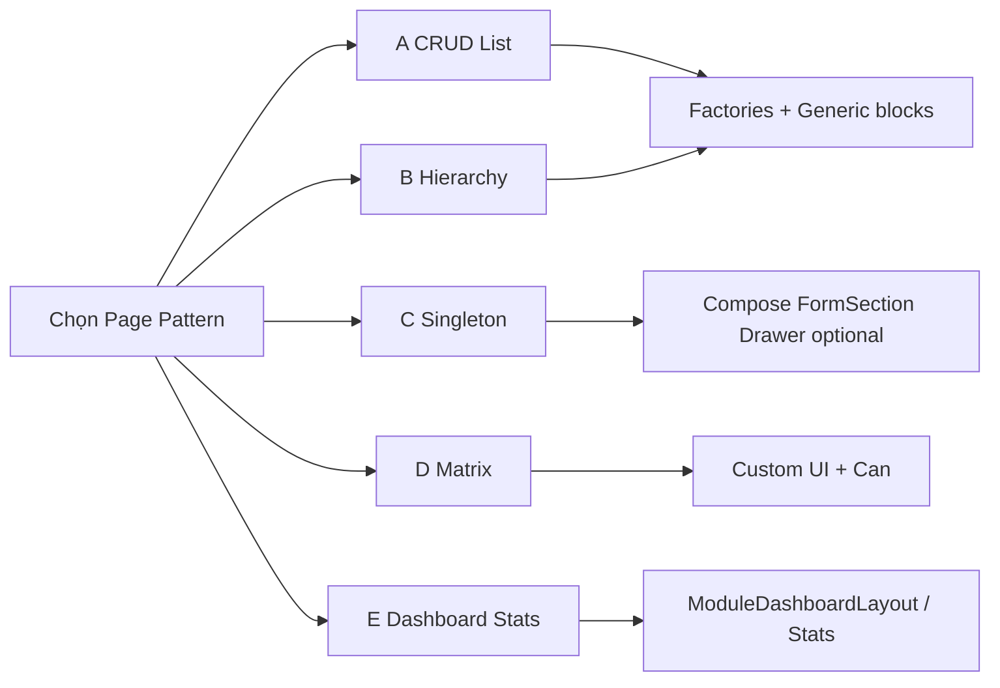

# Page Patterns

Business Foundation cung cấp **building blocks**, không ép mọi màn hình dùng cùng một factory.

Chọn đúng pattern trước khi copy UI từ Nhân viên / Phòng ban / Chức vụ.

Xem thêm: [`business-foundation.md`](./business-foundation.md) · [`component-catalog.md`](./component-catalog.md) · [`checklist-module.md`](./checklist-module.md).

---

## Tổng quan

| Pattern | Tên | Factory? | Ví dụ trong repo |
|---------|-----|----------|------------------|
| **A** | CRUD List | `createFeatureModule` hoặc `createFlatListFeatureModule` | Nhân viên; (flat list) |
| **B** | Hierarchy | `createHierarchyFeatureModule` hoặc flat + `HierarchyListShell` | Phòng ban; Chức vụ (UI cây) |
| **C** | Singleton | Không | Thông tin công ty |
| **D** | Matrix | Không | Phân quyền |
| **E** | Dashboard / Stats | Compose blocks | System dashboard; tab Thống kê NV |

---

## A — CRUD List

**Khi nào:** Entity có nhiều bản ghi, list + form + detail (+ optional stats/import/export).

**Building blocks:**

- Factory: `createFeatureModule` (có stats) hoặc `createFlatListFeatureModule`
- `GenericToolbar` + `ListToolbarActions` + `FilterChip*`
- `GenericTable` + `MobileListCard`
- `GenericDrawer` + form/detail stack
- `ImportDialog` / `ExportDialog` / `ConfirmDialog`
- Optional stats: `StatsKpiGrid`, `StatsDataGrid`, `StatsDrillDownDialog`, `StatsCard`

**Filter (module mới — chọn một, không hybrid):**

- **Pattern A (chip):** chips desktop + `filterGroups` mobile  
- **Pattern B (header):** column-header filter/search; **không** chip desktop cho cùng dimension; vẫn có search tổng + badge clear + mobile `filterGroups`

**Không dùng pattern A khi:** cây parent–child thật → Pattern B.

---

## B — Hierarchy

**Khi nào:** Cây phòng ban / danh mục cha–con, hoặc list phẳng hiển thị theo nhóm hierarchy.

**Building blocks:**

- `createHierarchyFeatureModule` (cây thật) **hoặc** `createFlatListFeatureModule` + `HierarchyListShell` / `HierarchyTable`
- Toolbar giống A
- Pagination: `TablePaginationFooter` (canonical)
- Stacked drawers: `stackLevel`, nested form/detail
- Child tables: `EmbeddedChildDataGrid` hoặc `GenericSubTableSection`

**Ví dụ:** Phòng ban (factory hierarchy); Chức vụ (flat data + hierarchy UI).

---

## C — Singleton

**Khi nào:** Một bản ghi cấu hình / hồ sơ công ty — không list.

**Building blocks:**

- Page form: `FormSection` / `FormGrid` (+ `RhfDataField` khi module mới / unfreeze)
- `DashboardToolbar` hoặc layout title + `getParentPath`
- `useCan('edit', resource)` — không `GenericToolbar` list

**Không:** Ép `createFeatureModule` / Import-Export list / selection.

**Repo:** `thong-tin-cong-ty` — **UI frozen**; không migrate trong Phase 2.5. Module singleton **mới** thì bám FormSection contract.

---

## D — Matrix

**Khi nào:** Lưới quyền / ma trận 2 trục (chức vụ × module).

**Building blocks:**

- Custom matrix UI
- `Can` / `useCan` / permission grants
- Loading: `LoadingSpinnerWithText`

**Không:** GenericTable CRUD factory.

**Repo:** `phan-quyen` — **UI frozen**. `PositionPermissionPicker` = **deprecated**.

---

## E — Dashboard / Stats

**Khi nào:** Trang nhóm submenu hoặc tab thống kê.

**Building blocks:**

- Dashboard: `ModuleDashboardLayout` + `SubModuleCard` (+ `ComingSoonLayout`)
- Stats tab: date range (`lib/stats-date-range.ts`), `StatsKpiGrid`, `StatsDataGrid`, `StatsCard`/`StatsTableCard`, `StatsDrillDownDialog`
- Header: `DashboardToolbar` khi cần

**Không:** Tự invent KPI card chrome trên module mới (dùng `StatsCard`).

---

## Consistency theo pattern (canonical)

| Concern | A Flat | B Hierarchy | C | D | E |
|---------|--------|-------------|---|---|---|
| Toolbar | `GenericToolbar` | `GenericToolbar` | `DashboardToolbar` / page header | Custom | `DashboardToolbar` |
| Pagination | `GenericTable` + `PageSizeSelect` | `TablePaginationFooter` | — | — | Stats footer |
| Drawer | `GenericDrawer` | `GenericDrawer` + stack | — / optional | — | Drill-down `AppDialog` |
| Detail order | Summary → Toolbar → Sections → System | Same | — | — | — |
| Search | Global (+ column nếu B filter) | Same | — | Custom | — |
| Empty / Loading | `EmptyState` / skeletons | Same | Spinner/form | Spinner | Stats loading |
| Import path (mới) | `@/components/views` | Same | Same | Same | Same |

---

## Grandfathered debt (không sửa code Phase 2.5)

**Existing modules** được phép giữ debt dưới đây.  
**New modules MUST NOT** copy các pattern lệch này — gate checklist sẽ fail review nếu hybrid filter / sai import barrel / bỏ `RhfDataField` khi form mới.

Drift chấp nhận trên module hiện có — **module mới không được copy**:

| Debt | Module | Canonical thay thế |
|------|--------|-------------------|
| Hybrid chip **và** column-header cùng dimension | NV, PB, CV | Chọn Pattern A **hoặc** B filter |
| Import `@/components/shared/*` thay vì views barrel | Features hiện tại | `@/components/views` |
| Form không dùng `RhfDataField` | NV, PB, CV, CTY | Adopt trên module mới |
| Bulk-edit thiếu `FormDrawerFooter` | NV | Dùng `FormDrawerFooter` |
| Charts hand-roll card chrome | NV `EmployeeStatsCharts` | `StatsCard` |
| Company form tự `h3`/card | CTY | `FormSection` khi unfreeze |
| Custom dept filter | PQ | Giữ frozen; không lan sang CRUD |

---

## Quy tắc chọn nhanh

1. Có list + CRUD drawers? → **A** hoặc **B**  
2. Có quan hệ cha–con / cây UI? → **B**  
3. Một record cấu hình? → **C**  
4. Ma trận 2 trục? → **D**  
5. Chỉ điều hướng nhóm / KPI? → **E**  
6. Không chắc? → đọc reference `features/he-thong/nhan-vien/` rồi hỏi product — **không** invent factory thứ 4.
